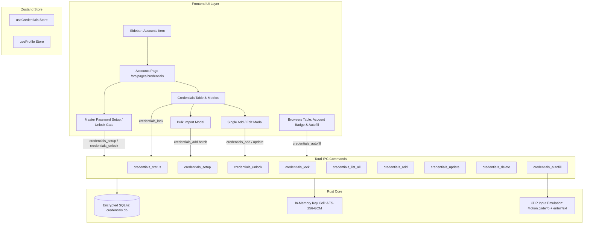

# Design Specification: ShardeX Account Manager (Unified Encrypted Vault)

**Date:** 2026-09-24  
**Status:** Approved  
**Target Components:**
- Rust Backend: `src-tauri/src/credentials.rs`, `src-tauri/src/lib.rs`
- Frontend API & Types: `src/entities/credentials/model/api.ts`, `src/shared/types/index.ts`
- State Store: `src/entities/credentials/lib/useCredentials.ts`
- UI Pages & Components: 
  - `src/pages/credentials/index.tsx`
  - `src/widgets/Credentials/CredentialsMetrics.tsx`
  - `src/widgets/Credentials/CredentialsTable.tsx`
  - `src/widgets/Credentials/CredentialModal.tsx`
  - `src/widgets/Credentials/BulkImportModal.tsx`
  - `src/widgets/Credentials/VaultGateModal.tsx`
- Navigation & Integration:
  - `src/widgets/Sidebar/Sidebar.tsx`
  - `src/app/App.tsx`
  - `src/widgets/ProfileTable/ProfileRow.tsx`
  - `src/features/manage-profiles/ui/ProfileRowActions.tsx`

---

## 1. Overview & Objective

Multi-accounting operators (crypto airdrop farmers, bounty hunters, e-commerce marketers, and automation engineers) need to manage dozens or hundreds of accounts across social networks (Google, X, Discord, Telegram, GitHub, Outlook) and assign them to specific browser profiles.

ShardX/ShardeX already has an underlying encrypted SQLite credential store (`src-tauri/src/credentials.rs`) using **AES-256-GCM** with PBKDF2 master password derivation and CDP human-typing autofill. However, it lacks a dedicated UI in the application, requiring users to rely on manual logins or raw APIs.

This specification outlines the full integration of the **Account Manager** into ShardeX:
1. **Centralized Workspace View:** A dedicated **"Accounts"** section in the main sidebar to monitor, search, filter, edit, and bulk-import credentials across all browser profiles.
2. **Encrypted Vault Lifecycle:** Seamless Master Password creation, session unlock in memory, and one-click manual lock to protect sensitive credentials.
3. **Bulk Account Importer:** Fast ingestion of multi-line credentials (e.g. `email:password` or `email:password:notes`) with flexible allocation (single profile or round-robin distribution).
4. **Direct Browser Row Integration:** Profile rows in the "Browsers" table display linked account badges and offer quick 1-click login autofill while a profile is running.

---

## 2. Architecture & Data Flow



---

## 3. Data Models & API Contracts

### 3.1 Backend Rust Extensions (`src-tauri/src/credentials.rs` & `src-tauri/src/lib.rs`)

1. **`list_all()` in `credentials.rs`:**
   ```rust
   pub fn list_all() -> Result<Vec<Credential>> {
       let conn = open()?;
       let mut stmt = conn.prepare(
           "SELECT id, profile_id, provider, email, password_enc, notes, created_at, last_used, keep_alive_minutes
              FROM credentials ORDER BY created_at DESC",
       )?;
       let rows = stmt.query_map([], |r| row_to_credential(r, String::new()))?;
       Ok(rows.collect::<rusqlite::Result<Vec<_>>>()?)
   }
   ```
2. **`credentials_list_all` command in `lib.rs`:**
   ```rust
   #[tauri::command]
   fn credentials_list_all() -> Result<Vec<credentials::Credential>, String> {
       credentials::list_all().map_err(|e| e.to_string())
   }
   ```
   Add to `tauri::generate_handler![..., credentials_list_all]`.

3. **Provider Templates Extension:**
   Add `telegram`, `github`, and `generic` to `pub fn providers()` alongside Google, X, and Discord.

### 3.2 Frontend API Model (`src/entities/credentials/model/api.ts`)

Add export:
```typescript
export const credentialsListAll = () => invoke<Credential[]>("credentials_list_all");
```

---

## 4. UI / UX Design & Component Structure

### 4.1 Navigation
- **`src/shared/types/index.ts`:** Add `"credentials"` to `Section` union type.
- **`src/widgets/Sidebar/Sidebar.tsx`:**
  Under `groupWorkspace`, add:
  ```typescript
  { id: "credentials", label: t("sidebar.navCredentials"), svg: <NavCredentialsIcon className="size-5" /> }
  ```
- **`src/app/App.tsx`:**
  ```typescript
  {section === "credentials" && <CredentialsPage />}
  ```

### 4.2 Credentials Store (`src/entities/credentials/lib/useCredentials.ts`)
- Manages:
  - `status`: `{ configured: boolean, unlocked: boolean }`
  - `credentials`: `Credential[]`
  - `providers`: `ProviderTemplate[]`
  - `loading`: `boolean`
  - `filterProfile`: `string | null`
  - `filterProvider`: `string | null`
  - `searchQuery`: `string`
- Actions:
  - `checkStatus()`
  - `setup(masterPassword)`
  - `unlock(masterPassword)`
  - `lock()`
  - `loadAll()`
  - `add(cred)`
  - `update(cred)`
  - `remove(id)`
  - `autofill(profileId, credentialId)`

### 4.3 Credentials Page (`src/pages/credentials/index.tsx`)
- If `!status.unlocked`:
  - If `!status.configured`: Renders `VaultGateModal` in "Create Master Password" mode with security advice.
  - If `status.configured`: Renders `VaultGateModal` in "Unlock Vault" mode.
- If `status.unlocked`:
  - **Topbar**: Breadcrumbs `["Workspace", "Accounts"]`, live search bar.
  - **Metrics Row**:
    - Total Accounts
    - Linked Profiles
    - Active Providers
    - Keep-Alive Active count
  - **Toolbar**:
    - Filter dropdown: Profiles (All / specific profile)
    - Filter dropdown: Providers (All / Google / X / Discord / Telegram / GitHub / Custom)
    - Button: `+ Add Account` (opens `CredentialModal`)
    - Button: `Bulk Import` (opens `BulkImportModal`)
    - Button: `Lock Vault` (locks in-memory key)
  - **Credentials Table**:
    - Columns: Provider Badge & Icon, Email/Username, Linked Profile (with status pill), Notes, Keep-Alive Switch, Last Used, Actions (Autofill, Edit, Delete).
    - Empty state when no accounts or filters return empty.

### 4.4 Bulk Import Modal (`BulkImportModal.tsx`)
- Inputs:
  - Allocation Mode: "Single Profile" vs "Distribute evenly across profiles"
  - Target Profile select (if Single Profile)
  - Default Provider select
  - Textarea supporting lines:
    - `email:password`
    - `email:password:notes`
    - `email,password,notes`
  - Live preview parser table showing total detected valid accounts.
  - Submit action: batch adds credentials and reports total imported.

### 4.5 Integration in Browsers Page (`ProfileRow.tsx` & `ProfileRowActions.tsx`)
- `ProfileRow.tsx`:
  - Show small account badge: e.g. `[2 accounts]` linking to credentials filtered by this profile.
- `ProfileRowActions.tsx`:
  - When profile is running and has saved credentials:
    - Provide a "Login Autofill" sub-item or quick-action that triggers `credentialsAutofill(profile.id, firstCred.id)`.

---

## 5. Security & Verification Strategy

1. **Security Invariants:**
   - Password plaintext is never returned over IPC from Rust to webview.
   - Master password derivation uses PBKDF2 (120,000 iterations) with local salt.
   - Lock action immediately overwrites in-memory key cell with `None`.
2. **Verification Steps:**
   - Rust unit tests: test `list_all()`, password encryption round-trip, lock/unlock cycle.
   - Frontend build & typecheck: `npm run build` or `tsc --noEmit`.
   - End-to-end operational verification:
     1. Set master password and unlock vault.
     2. Create account manually and verify it appears in table.
     3. Bulk import accounts and verify round-robin profile allocation.
     4. Lock vault and confirm accounts are cleared from memory.
     5. Test quick autofill trigger from browser profile row.
