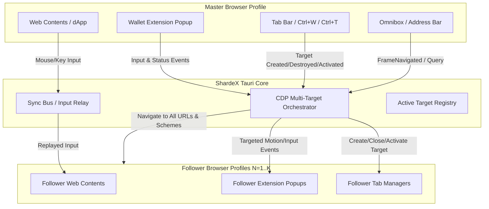

# Design Specification: ShardeX Launch Synced Airdrop Enhancements

**Date:** 2026-09-24  
**Status:** Approved  
**Target Components:**
- Rust Backend: `src-tauri/src/cdp.rs`, `src-tauri/src/lib.rs`, `src-tauri/src/sync_bus.rs`, `src-tauri/src/launch.rs`
- Frontend UI: `src/widgets/SyncPanel/SyncPanel.tsx`, `src/entities/profile/model/api.ts`

---

## 1. Overview & Objective

ShardeX launcher includes a "Launch Synced" mode that allows an operator to drive multiple browser profiles in parallel. While the current implementation handles basic mouse/keyboard input mirroring within a single webpage, crypto airdrop farming workflows frequently break due to:
1. **Extension Popups:** Wallet confirmations (MetaMask, Rabby, Phantom, OKX) open in separate popup windows (`chrome-extension://...`) which are currently ignored by the input sync bus.
2. **Search Bar / Omnibox Typing:** Native Chromium address bar inputs are not mirrored until navigation commits, and navigation filtering ignores extension pages (`chrome-extension://`), search queries, and internal pages.
3. **Tab Lifecycle Desync:** Closing tabs via `Ctrl+W` or tab bar 'x' buttons in the Master window leaves tabs open in Followers. Switching active tabs in Master does not switch active tabs in Followers, causing clicks to hit wrong elements.
4. **Toolbar Extension Launching:** Operator clicking extension icons in the native browser toolbar cannot mirror to followers because the toolbar is outside web DOM coordinates.

This design upgrades the synchronization orchestrator using **CDP Multi-Target Orchestration & Motion Routing**, delivering a seamless experience for multi-account crypto airdrop execution.

---

## 2. Architecture & Data Flow

---

## 3. Detailed Subsystem Specifications

### 3.1. Extension Popup Synchronization
* **Target Detection**:
  - `src-tauri/src/cdp.rs` configures `Target.setAutoAttach` with `autoAttach: true`, `flatten: true`, and monitors `Target.targetCreated` and `Target.attachedToTarget`.
  - When `targetInfo.url` matches `chrome-extension://*`, the target is tagged as an **Extension Target**.
  - Targets are mapped by profile: `HashMap<ProfileId, Vec<ExtensionTarget>>`.
* **Input Routing for Popups**:
  - When Master interacts with an extension target, click/keyboard events captured via CDP or the sync bus are routed exclusively to the active extension target across all followers using `cdp::page_call(follower_id, "Motion.tap" | "Input.dispatchMouseEvent", ...)`.
  - Popups support text entry (e.g. typing passwords into wallet inputs) and click actions (Next, Connect, Sign, Confirm).
* **Popup Alignment ("Tile Popups")**:
  - A backend command `sync_arrange_popups(group)` queries all open extension popup window handles/targets and calculates layout coordinates adjacent to each parent browser window, bringing all popups into clear view simultaneously.

### 3.2. Manual Extension Opening & Wallet Quick Actions
* **Extension Quick-Launcher**:
  - SyncPanel queries installed extensions for the profiles in the group (`extensions::list`).
  - Provides a single-click button: **"Open Wallet in All"**.
  - When triggered, invokes `sync_open_extension(group, extension_id)` which computes the popup/home URL (e.g., `chrome-extension://<id>/home.html` or `popup.html`) and opens it as an active tab or window in all profiles.
* **Master Unlock Feature ("Unlock All Wallets")**:
  - Operators can input their master wallet password once in SyncPanel.
  - Rust command `sync_unlock_wallets(group, password)` inspects all open extension targets for password input fields, inputs the password via `Motion.enterText`, and clicks the submit/unlock button in parallel across all profiles.

### 3.3. Tab Lifecycle Synchronization
* **Close Tab Sync (`Ctrl+W` / 'x' Button)**:
  - Rust nav watcher listens for `Target.targetDestroyed` events on the Master profile.
  - Determines the closing tab index or target ID.
  - Sends `Target.closeTarget` to the corresponding active/indexed tab on all Follower profiles.
  - Safety rule: If the tab being closed is the last remaining tab in the window, prevent accidental closure of the browser process unless explicitly confirmed.
* **Switch Tab Sync (Tab Activation)**:
  - Master emits `Target.targetInfoChanged` or window focus events when switching between tabs.
  - The watcher tracks the active tab index on Master and calls `Target.activateTarget` on followers.
  - Ensures mouse clicks and scrolls in Master land on the exact same active page on all followers.
* **New Tab Sync (`Ctrl+T` / '+' Button / Target Blank)**:
  - Monitored via `Target.targetCreated`.
  - Follower profiles create a new tab via `Target.createTarget` with matching initial URL.
  - Anti-duplication guard: De-duplicates new tab actions triggered within 500ms by dApp scripts to prevent cascading duplicate tabs.

### 3.4. Omnibox & Search Bar Sync
* **Scheme Expansion**:
  - Remove the limitation in `src-tauri/src/lib.rs` (`if url.starts_with("http://") || url.starts_with("https://")`).
  - Support `chrome-extension://`, `chrome://`, `about:blank`, and custom protocols.
  - Support SPA routing via `Page.navigatedWithinDocument`.
* **Search Query Handling**:
  - When an address bar entry does not contain a scheme or valid host, format it into a default search engine query URL (e.g., `https://www.google.com/search?q={query}`) and broadcast.
* **Quick Omnibox in SyncPanel**:
  - Enhanced URL bar in SyncPanel with history, favorites/airdrop shortcuts, and hotkey support (`Ctrl+L` / `Alt+D`).

---

## 4. Error Handling & Edge Cases

| Scenario | Risk | Mitigation |
| :--- | :--- | :--- |
| **Proxy Latency Variance** | Profile A loads page in 1s, Profile B takes 5s due to slow proxy. Clicks on B miss or hit unloaded elements. | Delay buffer + `Page.loadEventFired` gating. Critical transactions can hold follower execution until DOM readiness is confirmed. |
| **Missing Popup on 1 Profile** | dApp failed to trigger wallet popup on Profile #3. | Pop-up count verification: SyncPanel displays warning badge if follower popup count < master popup count before approving. |
| **Extension ID Mismatch** | Profiles using different extension IDs for custom extensions. | Standardize extensions using installed extension UUID/manifest key mapping. |
| **Accidental Window Close** | Pressing `Ctrl+W` on only tab closes Master window. | Guard intercepts last-tab close; opens `about:blank` instead of killing follower browser instances. |

---

## 5. Testing & Verification Plan

1. **Extension Popup Mirroring Test**:
   - Open 3 profiles in synced mode with MetaMask installed.
   - Navigate to Uniswap / test dApp.
   - Click "Connect Wallet" $\rightarrow$ verify all 3 popups appear.
   - Click "Next" $\rightarrow$ "Connect" on Master $\rightarrow$ verify all 3 profiles connect.
2. **Tab Lifecycle Verification**:
   - Open 3 tabs on Master $\rightarrow$ verify Followers have 3 tabs.
   - Switch from Tab 3 to Tab 1 on Master $\rightarrow$ verify Followers activate Tab 1.
   - Press `Ctrl+W` on Tab 1 $\rightarrow$ verify Tab 1 closes across all Followers.
3. **Omnibox & Search Bar Test**:
   - Type search query "ethereum bridge testnet" into address bar $\rightarrow$ verify all Followers navigate to search results.
   - Type `chrome-extension://...` URL $\rightarrow$ verify Followers navigate to the extension page.
4. **Unlock All Wallets Test**:
   - Launch group with locked wallets.
   - Run "Unlock All" from SyncPanel with test password $\rightarrow$ verify all 3 wallets unlock simultaneously.
